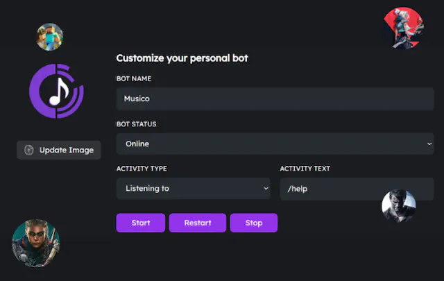
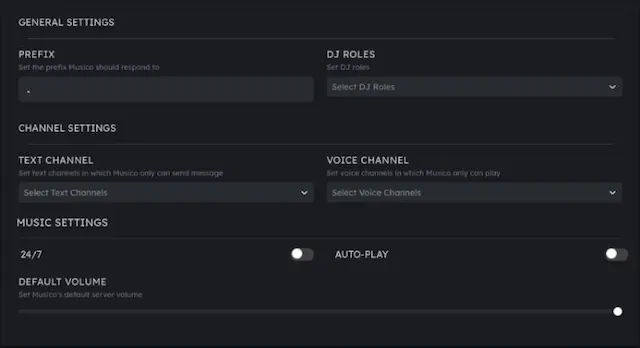

# 🎧 User Guide & Tutorials&#x20;

> 🎶 _**Musico's User Guide**_ - _**Your Pathway to Musical Mastery!**_ 🎶

## What is MusicoBot

**Listen to your favorite music on discord with your friends! Edit music with audio filters, customize playlists, auto play, 24/7 and much more!**

### Why Use Musico?

Musico is one of the best discord music bots that you can find! Feature rich with the most _**Add Free**_ sources which include _**Apple - YouTube Music - Spotify - Soundcloud**_

## Custom Bot Creation Made Easy!

Customize your own bot like never before with our Custom MusicoBot. Think of it as your Server's most unique discord bot. You are in charge and Musico follows your lead!

<figure><figcaption></figcaption></figure>

### Web Player

Manage the music directly from the Dashboard, get rid of duplicate tracks, decide what to skip with your friends, and more.


#### _<mark style="color:blue;">This Feature will be implemented soon!</mark>_&#x20;


## Advanced Web Dashboard.

Everything you need is right at your fingertips. Set your servers prefix, configure text and voice channels, adjust default volume, and more! all without the need for manual command typing.

<figure><figcaption></figcaption></figure>

## &#x20;                           Discover, Share, and Groove.

## Quick links


[premium-packages](user-guide-and-tutorials/premium-packages/)



[supported-sources.md](guide-overview/supported-sources.md)



[musicobot-features.md](guide-overview/musicobot-features.md)


## Configuring Musico&#x20;

We've put together some helpful guides for you to get setup quickly and easily.


[setting-up-musicobot.md](guide-overview/getting-started/setting-up-musicobot.md)



[musicobot-commands](guide-overview/getting-started/musicobot-commands/)



[musicobot-and-dj-roles](guide-overview/getting-started/musicobot-and-dj-roles/)



[Broken link](broken-reference)

