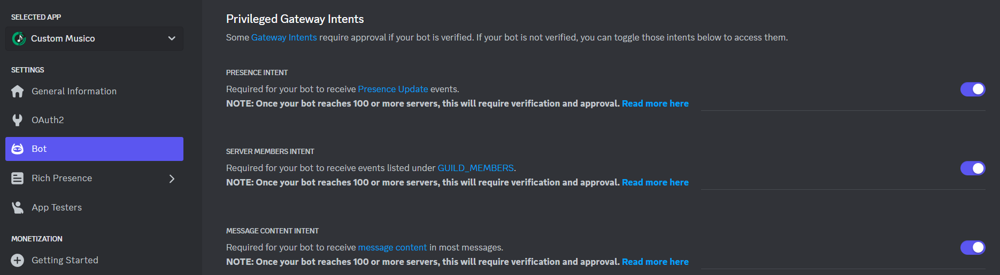

# Step By Step Setup

### <mark style="color:orange;">First Create Your App</mark>&#x20;

First, you'll need to create an App in the [<mark style="color:purple;">**Discord Developer Porta**</mark><mark style="color:purple;">l</mark>](https://discord.com/developers/applications) if you don't have one already:

[_<mark style="color:purple;">**Create Your Discord Bot App**</mark>_](https://discord.com/developers/applications?new_application=true)

Enter a name for your app, then press Create.

<figure><figcaption>
Click Create When Ready To Continue
</figcaption></figure>

**After you create your app, you'll land on the General Overview page**&#x20;

<figure><figcaption></figcaption></figure>

This is where you can update basic information about your app, like its description and icon. You'll also see an _<mark style="color:orange;">**Application ID**</mark>_**.**&#x20;

<figure><figcaption>
<strong>This is the developers Name and Icon Settings not what is reflected in your Discord Server. See</strong> <a href="step-by-step-setup.md#bot-section"><strong>Bot Section</strong></a>
</figcaption></figure>


### Copy the _<mark style="color:orange;">Application ID</mark>_ to a notepad or Take note of its location. You will need it to paste in your _Customs Musico Dashboard_ later on.


***

### <mark style="color:orange;">The Bot Section</mark>&#x20;

As you can see this is where you can set the _<mark style="color:green;">**"Username"**</mark>_ and Choose your Custom Bots _<mark style="color:green;">**"Icon" (Avatar)**</mark>_

<figure><figcaption>
<strong>The Username and Avatar (Icon) chosen here will reflect what it will look like in your Discord Server</strong>
</figcaption></figure>

### A) Get your _<mark style="color:orange;">Bot Token</mark>_

You will see the "_<mark style="color:orange;">**Reset Token**</mark>_" button, **click it** and **copy the token down in your notepad**, we will need that in the **Customs Musico Dashboard** later on.

### B) Setting up [<mark style="color:green;">Privileged Gateway Intents</mark>](broken-reference)

You have to enable settings like its [privileged intents](#user-content-fn-1)[^1] in order for your bot to work correctly. See below for an example:&#x20;

<figure><figcaption>
Please make sure ALL 3 are selected to Enabled
</figcaption></figure>

<mark style="color:orange;">PRESENCE INTENT</mark>

Required for your bot to receive [Presence Update](https://discord.com/developers/docs/topics/gateway#presence-update) events.

**NOTE: Once your bot reaches 100 or more servers, this will require verification and approval.** [**Read more here**](https://support.discord.com/hc/en-us/articles/360040720412)

<mark style="color:orange;">SERVER MEMBERS INTENT</mark>

Required for your bot to receive events listed under [GUILD\_MEMBERS](https://discord.com/developers/docs/topics/gateway#list-of-intents).

**NOTE: Once your bot reaches 100 or more servers, this will require verification and approval.** [**Read more here**](https://support.discord.com/hc/en-us/articles/360040720412)

<mark style="color:orange;">MESSAGE CONTENT INTENT</mark>

Required for your bot to receive [message content](https://support-dev.discord.com/hc/en-us/articles/4404772028055) in most messages.

**NOTE: Once your bot reaches 100 or more servers, this will require verification and approval.** [**Read more here**](https://support.discord.com/hc/en-us/articles/360040720412)

### <mark style="color:orange;">OAuth2 Section (</mark><mark style="color:green;">Adding the bot to your server</mark><mark style="color:orange;">)</mark>

Click on <mark style="color:orange;">**OAuth2**</mark> in the left sidebar, then select <mark style="color:orange;">**Bot**</mark> Under the <mark style="color:green;">**URL generator**</mark>.

<figure><figcaption>
First Select Bot 
</figcaption></figure>

&#x20;After you select <mark style="color:orange;">**`Bot`**</mark>, you may also select different permissions for your bot. For now let us just check <mark style="color:orange;">**Administrator**</mark>. This will _generate the link at the bottom_ used to Invite your bot to your Discord Server!

#### <mark style="color:red;">Example of Selections Required to Generate Link:</mark>

<figure><figcaption>
COPY THIS LINK AND PASTE INTO YOUR BROWSER TO INVITE YOUR BOT
</figcaption></figure>

Copy and paste into your browser to invite your Music Bot to your Discord Server, _Please Continue to the_ [_Custom Musico Dashboard_](step-by-step-setup.md#musico-dashboard-setup-and-configuration)_to finish Setup._

[^1]: Some intents are defined as "privileged" due to the sensitive nature of the data. Currently, those intents include:

    * `GUILD_PRESENCES`
    * `GUILD_MEMBERS`
    * [`MESSAGE_CONTENT`](https://discord.com/developers/docs/topics/gateway#message-content-intent)

    Apps that qualify for verification must be approved for the privileged intent(s) before they can use them.&#x20;

    intents within the app's settings within the Developer Portal.

    Before you specify privileged intents in your `IDENTIFY` payload, you must enable the privileged intents your app requires. [Verified apps](https://support.discord.com/hc/en-us/articles/360040720412-Bot-Verification-and-Data-Whitelisting) can only use privileged intents after they've been approved for them.
