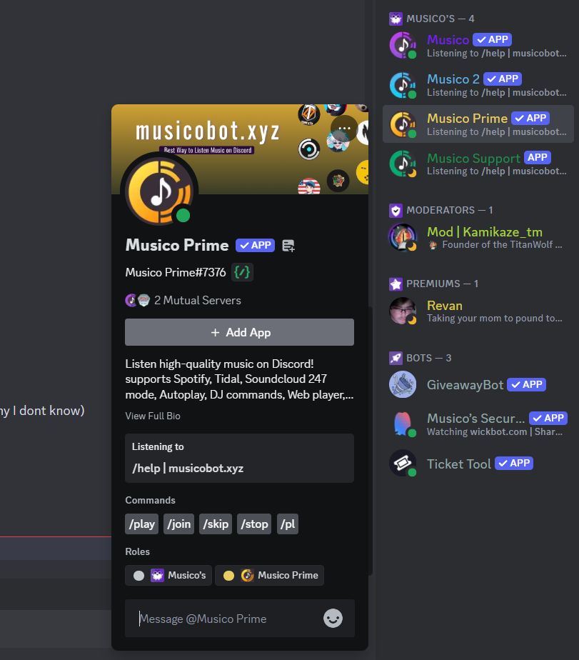

# 🌟 Premium/Customs  Account Activation Procedures

<figure><figcaption></figcaption></figure>

To add **Musico Prime** through the [<mark style="color:purple;">Musico Support Discord server</mark>](https://discord.gg/N65PTWSj7P), left-click on "<mark style="color:yellow;">**Musico Prime**</mark>" and select `+Add App` from the dropdown menu.

Completing this first will ensure a smooth transition from a free to a subscription account:

* Add **Musico Prime** using the steps above.
* Activate the premium features post integration.
* This order of actions helps avoid disruptions during the upgrade.

Now that you've successfully added **Musico Prime**, you can move on to the next step listed below to continue the upgrade process smoothly.
