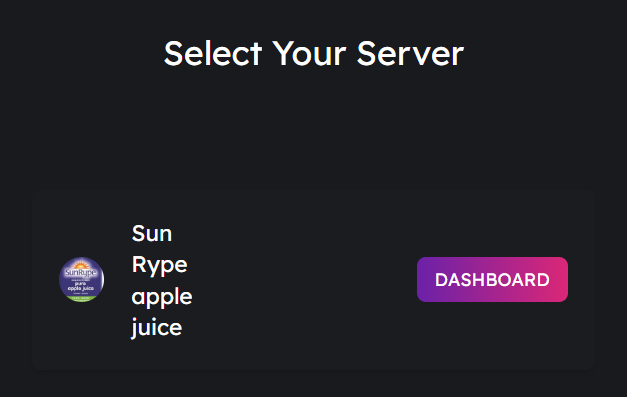

# 🌐 MusicoBot Dashboard

**On** [**Musico's Website**](../../) **login and select the "Dashboard" Menu**&#x20;

<figure><figcaption>
Example of the MusicoBot Website Menue
</figcaption></figure>

Now you will get the option to setup Musico in one of your servers or view the dashboard for servers that already have the bot.&#x20;


Essentially _**"Setup"**_ means it is not on that server and selecting it will invite MusicoBot to your server. However if the bot is already in your server you will see _**"Dashboard"**_ option instead of _**"Setup"**_


<figure><figcaption>
An example of the Setup Option
</figcaption></figure>

Lets say you have MusicoBot in your server, now its time to configure some settings in the Dashboard!&#x20;

<figure><figcaption>
Example of the Dashboard Option
</figcaption></figure>

***

#### MusicoBot Dashboard

Now you should see the dashboard! As you can see there are a few settings in here that you can change and set such as your servers Prefix, [DJ Roles](musicobot-and-dj-roles/dj-commands.md), Text & Voice Channels. &#x20;

<figure><figcaption>
Default Dashboard Page
</figcaption></figure>
