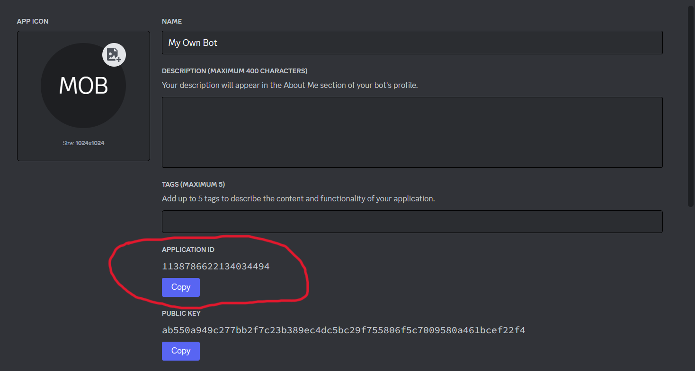
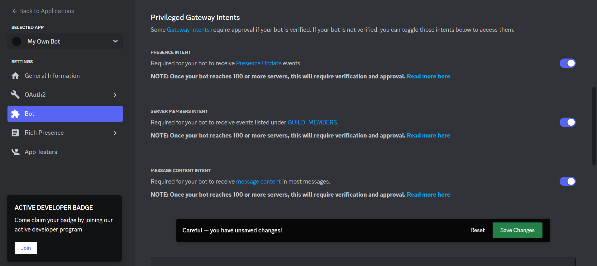
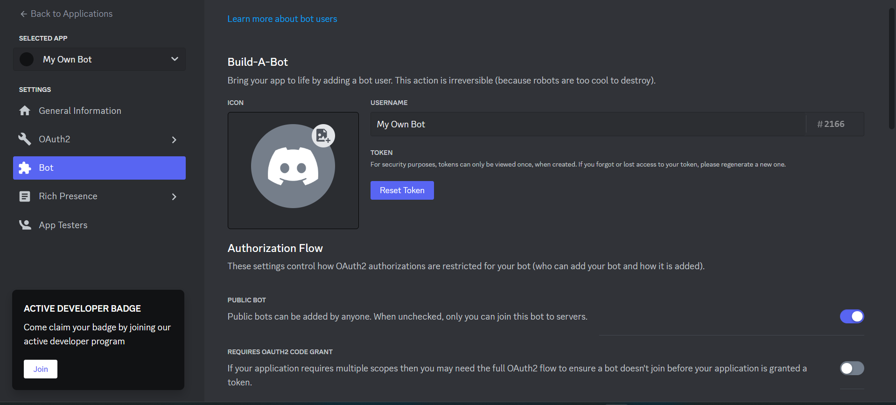
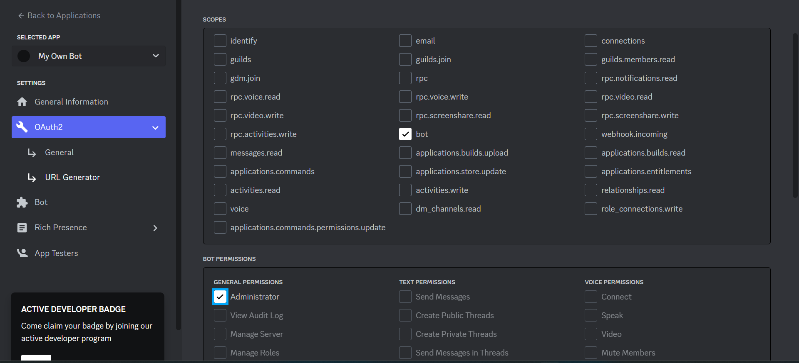
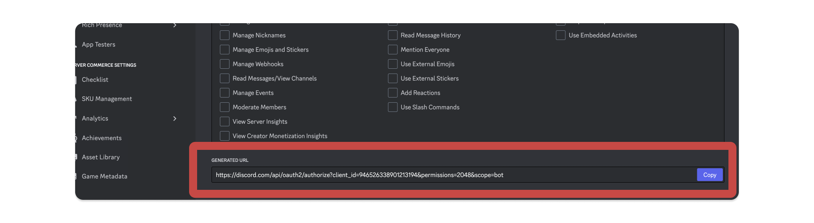

# Setup your CustomBot in Just 3 Easy Steps!

## **Setup your Custom Bot in Just 3 Easy Step**

[**Before starting, note that the following video will help you.** ](#user-content-fn-1)[^1]



## 1️⃣ Getting your bot ID 

First, you'll need to create an app in the developer portal if you don't have one already:

[<mark style="color:purple;">**Create App**</mark>](https://discord.com/developers/applications?new_application=true)

Enter a name for your app, then press Create.

After you create your app, you'll land on the General Overview page of the app's settings where you can update basic information about your app like its description and icon. You'll also see an **Application ID and Interactions Endpoint URL**, Copy that ID and paste on Musico dashboard.

<figure><figcaption></figcaption></figure>

**Configuring your bot**

On the left hand sidebar click **Bot**. On this page, you have to enable settings like its [privileged intents](https://discord.com/developers/docs/topics/gateway#privileged-intents) in order to work your bot

<figure><figcaption></figcaption></figure>

## &#x20;2️⃣ Getting your bot TOKEN 

There's also a Token section on the **Bot page**, which allows you to copy and reset your bot's token.

Go ahead and click in **Reset Token** button copy the **token**, and Paste on musico dashboard.

<figure><figcaption></figcaption></figure>

## 3️⃣ Add bot to your server

Click on **OAuth2** in the left sidebar, then select **URL generator**.

After you select `bot`, you can also select different permissions for your bot. For now, just check **Administrator**.

<figure><figcaption></figcaption></figure>

Once you add scopes, you should see a **URL** that you can copy to install your bot.

<figure><figcaption></figcaption></figure>

Copy the **URL** from above, and paste it into your browser. You'll be guided through the installation flow, where you should make sure you're installing your bot on a server where you can use it.

<mark style="color:purple;">**You're all set, Enjoy listening to music with your own bot!**</mark>

[^1]: We will still provide the steps below the video if you get stuck or encounter issues.&#x20;
